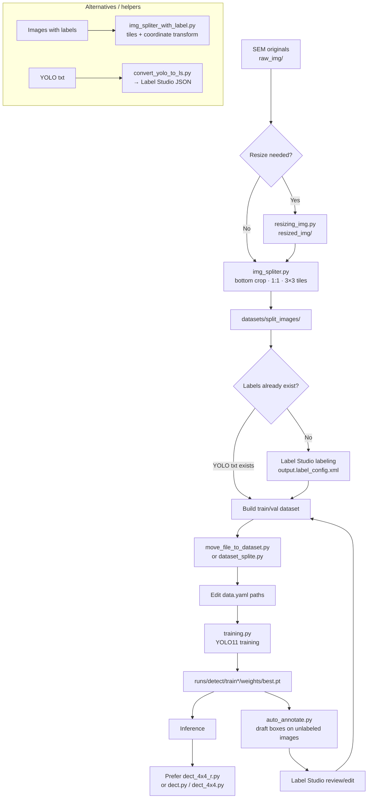

# Label Studio · YOLO Nanogap Detection Workspace

[한국어](README.md) | **English**

Workspace for detecting **many small objects of a single class `nanogap`** in SEM (scanning electron microscope) images.  
Train and run inference with **Ultralytics YOLO11**, and optionally sync rectangle labels with **Label Studio**.

Raw SEM frames are large while targets are tiny, so the default flow is to **tile (split) images** before labeling, training, and inference.

> **Related project:** This repository is the **training workspace** for [Nano-Particle-Detector](https://github.com/jslee-2int/Nano-Particle-Detector).  
> Weights produced here (`best.pt`, etc.) are used by that project's PyQt6 GUI and inference pipeline.

> **Security note:** This GitHub repository does **not** include SEM images, datasets, model weights (`*.pt`), or `runs/` artifacts.  
> Prepare `raw_img/`, `datasets/`, and model files locally. See `.gitignore` for exclusion rules.

---

## End-to-end workflow



### One-line summary

First pass: **SEM → (resize) → split → Label Studio → train/val → training → inference**  
Then iterate: **auto_annotate → Label Studio review → retrain → inference**

---

## Requirements / install

- Python 3.10+ recommended (Label Studio also recommends Python 3.10+)
- CUDA-enabled PyTorch for GPU training/inference

Dependency files:

| File | Purpose |
|------|---------|
| `requirements.txt` | YOLO train / infer / preprocess |
| `requirements-labelstudio.txt` | Label Studio (separate venv recommended) |

### YOLO / training environment

```powershell
python -m venv .venv
.\.venv\Scripts\Activate.ps1
python -m pip install -U pip
pip install -r requirements.txt
```

If the GPU `torch` build does not match your CUDA version, install the correct wheel from the [PyTorch get-started page](https://pytorch.org/get-started/locally/) first, then install the rest:

```powershell
pip install torch --index-url https://download.pytorch.org/whl/cu124
pip install -r requirements.txt
```

Check CUDA availability:

```bash
python check_ver.py
```

Install Label Studio in a **separate virtual environment** from YOLO/training. See [Install and run Label Studio](#install-and-run-label-studio).

---

## Install and run Label Studio

Local labeling UI. Default URL: [http://localhost:8080](http://localhost:8080).

### 1) Create and activate a venv (Windows)

```powershell
python -m venv .venv-ls
.\.venv-ls\Scripts\Activate.ps1
python -m pip install -U pip
```

Linux / macOS:

```bash
python3 -m venv .venv-ls
source .venv-ls/bin/activate
python -m pip install -U pip
```

### 2) Install

```bash
pip install -r requirements-labelstudio.txt
```

Or directly:

```bash
pip install label-studio
```

Upgrade:

```bash
pip install --upgrade label-studio
```

### 3) Start

```bash
label-studio
```

If the browser does not open automatically, go to [http://localhost:8080](http://localhost:8080).  
On first run, create an account (email/password) and sign in.

If port 8080 is busy:

```bash
label-studio --port 8081
```

To set a custom data directory:

```bash
label-studio start --data-dir C:\label-studio-data
```

### 4) If Windows cannot find `label-studio`

Confirm the venv is active, then try:

```powershell
python -m label_studio
```

Or check whether Scripts is on PATH:

```powershell
where.exe label-studio
```

### 5) (Optional) Run with Docker

```bash
docker run -it -p 8080:8080 -v %CD%:/label-studio/data heartexlabs/label-studio:latest
```

See the [Label Studio install guide](https://labelstud.io/guide/install.html) for more options.

### 6) Project setup for this repo

1. In the Label Studio UI, **Create Project**
2. **Labeling Setup** → switch to Code mode and paste `output.label_config.xml`:

```xml
<View>
  <Image name="image" value="$image"/>
  <Header value="RectangleLabels"/>
  <RectangleLabels name="label" toName="image">
    <Label value="nanogap" background="rgba(218, 1, 238, 1)"/>
  </RectangleLabels>
</View>
```

3. **Import** images from `datasets/split_images/` (or your labeling folder)  
   - For large local sets, *Local Storage* / *Cloud Storage* may be needed (extra setup)
4. Draw `nanogap` rectangles and **Submit**
5. **Export**  
   - For YOLO training: export **YOLO** format (images + `classes.txt` + labels)  
   - Or export JSON and convert/arrange into the YOLO layout used here

To bring YOLO txt back into Label Studio for review:

```bash
# Edit paths, image size, and class_map at the bottom of convert_yolo_to_ls.py, then:
python convert_yolo_to_ls.py
```

> Tip: Keep YOLO (`ultralytics` / `torch`) and Label Studio in separate venvs to reduce dependency conflicts.

---

## Directory layout

| Path | Description |
|------|-------------|
| `raw_img/` | Raw SEM images |
| `resized_img/` | Output of `resizing_img.py` (default 1100×825) |
| `datasets/split_images/` | Default tiled output |
| `datasets/moved_images/` | Images held out before split |
| `datasets/dataset/` | YOLO `images/{train,val}`, `labels/{train,val}` |
| `runs/detect/` | Training (`train*`) and predict (`predict*`) outputs |
| `output.label_config.xml` | Example Label Studio `nanogap` RectangleLabels config |
| `data.yaml` | Dataset paths and class definitions |
| `requirements.txt` | YOLO train/infer dependencies |
| `requirements-labelstudio.txt` | Label Studio dependencies (separate venv) |
| `yolo11*.pt`, `yolov8n.pt` | Pretrained weights (large) |
| `ui_main.ui` | Qt Designer UI (standalone Python runner may be missing) |

> Be careful committing `*.pt` and `runs/` — they are large.

---

## Settings you must edit before running

Most scripts have **hardcoded absolute/relative paths**. Update them for your machine.

| File | What to change |
|------|----------------|
| `data.yaml` | `train` / `val` paths (may still point at another PC, e.g. `D:/Py_Codes/...`) |
| `training.py` | Weights (`yolo11m.pt`, etc.), `epochs`, `imgsz`, `batch`, `device`, `workers` |
| `auto_annotate.py` | `best.pt` path, `source` folder, `conf` / `iou` / `max_det` |
| `move_file_to_dataset.py` | Source image/label folders, `dataset_dir` |
| `dataset_splite.py` | Actual `dataset/images`, `dataset/labels` locations |
| `dect.py`, `dect_4x4.py`, `dect_4x4_r.py` | Model and input image paths |
| `img_spliter.py` | `input_folder`, `output_dir`, `grid_size` |
| `convert_yolo_to_ls.py` | YOLO txt path, image size, `class_map` |

Example `data.yaml` for this workspace:

```yaml
train: C:/Pycode/detect_ng_training/datasets/dataset/images/train/
val: C:/Pycode/detect_ng_training/datasets/dataset/images/val/

nc: 1
names: ['nanogap']
max_det: 5000
```

---

## Step-by-step usage

### 1) Place SEM originals

Put source images in `raw_img/`.

### 2) (Optional) Resize

```bash
python resizing_img.py
```

- Input: `raw_img/`
- Output: `resized_img/` (default `1100×825`)

Then point the split script at either `resized_img` or `raw_img`.

### 3) Tile images (split)

```bash
python img_spliter.py
```

Default behavior:

- Crop about **130px** from the bottom (e.g. scale bar)
- Force **1:1** aspect
- Split into a **3×3** grid
- Output: `datasets/split_images/`
- (Depending on script options) move some images to `datasets/moved_images/`

If images already have YOLO labels:

```bash
python img_spliter_with_label.py
```

→ Tiles images and remaps label coordinates per tile.

### 4) Label Studio labeling

Follow **[Install and run Label Studio](#install-and-run-label-studio)** for install, project creation, label config, and export.

Summary:

1. Run `label-studio` → http://localhost:8080
2. Create a project and apply `output.label_config.xml` (`nanogap`)
3. Import images from `datasets/split_images/`
4. Draw boxes and export in **YOLO** format
5. Place export into the `datasets/dataset/` layout (next step)

### 5) Build train / val dataset

Match images (`.jpg`) and labels (`.txt`) to the YOLO layout:

```text
datasets/dataset/
  images/train/
  images/val/
  labels/train/
  labels/val/
```

Copy from external folders and split 8:2:

```bash
# Edit paths in move_file_to_dataset.py, then:
python move_file_to_dataset.py
```

If everything is already under `dataset/images` + `dataset/labels`:

```bash
# Check paths in dataset_splite.py, then:
python dataset_splite.py
```

### 6) Train

1. Set `train` / `val` in `data.yaml` to your paths
2. Adjust GPU / batch in `training.py`
3. Run:

```bash
python training.py
```

Defaults in code:

- Model: `yolo11m.pt`
- `epochs=500`, `imgsz=704`, `batch=4`, `device=0`, `workers=2`

Weights are saved under `runs/detect/train*/weights/best.pt` (and `last.pt`).

### 7) Inference

| Script | Use |
|--------|-----|
| `dect_4x4_r.py` | **Recommended for production**. Grid + padding, IoU merge, area (μm²) stats |
| `dect_4x4.py` | Simple NxN split inference and merge |
| `dect.py` | Single-image inference + size-colored boxes / histogram |

Edit `model_path`, image path, `conf` / `iou` in each file before running.

Example (`dect_4x4_r.py` bottom):

```python
detector = ParticleDetector(
    model_path='runs/detect/train22/weights/best.pt',
    grid_size=4,
    iou_threshold=0.08,
    padding=5,
    confidence_threshold=0.5,
    aspect_ratio_threshold=1,
)
detector.visualize_results(r"raw_img/your_sem_image.jpg")
```

### 8) Auto-label → review → retrain (loop)

```bash
# Edit best.pt / source / conf in auto_annotate.py, then:
python auto_annotate.py
```

- Writes predicted images + YOLO `txt` drafts for an unlabeled folder
- Review/edit in Label Studio
- Merge into train/val and rerun `training.py`
- Infer again with the improved `best.pt`

---

## Script reference

| File | Role | Main I/O |
|------|------|----------|
| `check_ver.py` | Print CUDA / GPU availability | — |
| `resizing_img.py` | Batch resize | `raw_img/` → `resized_img/` |
| `img_spliter.py` | Bottom crop, square, grid tiles | `raw_img/` → `datasets/split_images/` |
| `img_spliter_with_label.py` | Tile + label coordinate transform | images/txt → tiles/txt |
| `move_file_to_dataset.py` | Copy external data, 8:2 split | source → `datasets/dataset/...` |
| `dataset_splite.py` | Move a flat folder into train/val | `dataset/images·labels` → `train`/`val` |
| `training.py` | YOLO11 training | `data.yaml` → `runs/detect/train*` |
| `auto_annotate.py` | Batch predict + save txt | image folder → predict + labels |
| `convert_yolo_to_ls.py` | YOLO txt → Label Studio JSON | `.txt` → `output.json` |
| `dect.py` | Single inference + size distribution viz | image → `output.jpg`, etc. |
| `dect_4x4.py` | Grid split inference + merge | image → display/result |
| `dect_4x4_r.py` | Padding, clustering, area analysis | image → viz + stats |
| `output.label_config.xml` | Label Studio label config | Label Studio UI |
| `yolo11.yaml` | Custom architecture sketch (reference) | Training usually uses `yolo11*.pt` + `data.yaml` |
| `requirements.txt` | YOLO/train deps | `pip install -r requirements.txt` |
| `requirements-labelstudio.txt` | Label Studio deps | `pip install -r requirements-labelstudio.txt` |

---

## Training outputs · model tips

- Training runs land under `runs/detect/trainN/`.
- For inference and auto-label, use `runs/detect/trainN/weights/best.pt`.
- Some script examples still point at `train21` / `train22` — **switch to your latest `best.pt`**.
- Rough pretrained size order: `yolo11n` < `yolo11m` < `yolo11l` (speed ↔ accuracy).
- Dense objects may need a large `max_det` (e.g. 5000); that setting appears in the configs/code.

Local workspace notes (may differ on your machine):

- `datasets/dataset` may contain train/val images
- `raw_img/` and `resized_img/` may contain sample images
- `runs/detect/` may contain many `train*` / `predict*` runs

---

## Label Studio integration notes

- Install/run: [Install and run Label Studio](#install-and-run-label-studio) (`pip install label-studio` → `label-studio` → http://localhost:8080)
- Label config: `output.label_config.xml` (`nanogap` rectangles)
- Preferred path: label in Label Studio → **YOLO** export → place under `datasets/dataset` → train
- Reverse path: YOLO txt → `convert_yolo_to_ls.py` → review in Label Studio
- Prefer reviewing auto_annotate drafts in Label Studio before adding them to training data
- Separate YOLO and Label Studio venvs to reduce dependency conflicts

---

## Common mistakes / checklist

- [ ] Is Label Studio running? (`label-studio` → http://localhost:8080)
- [ ] Is `nanogap` from `output.label_config.xml` applied?
- [ ] Do `data.yaml` train/val paths point at **this PC**?
- [ ] Do image and label basenames match? (`foo.jpg` ↔ `foo.txt`)
- [ ] Is the Label Studio export YOLO (normalized coordinates)?
- [ ] Are `device` / `batch` in `training.py` suitable for your GPU memory?
- [ ] Do inference / `auto_annotate` use the latest `best.pt`?
- [ ] If you trained on tiles, does inference use the same preprocess/grid strategy?
- [ ] Are `conf` / `iou` / `max_det` tuned for dense objects?

---

## License

If this repository has no LICENSE file, follow the licenses of **Ultralytics YOLO** and **Label Studio** respectively.
