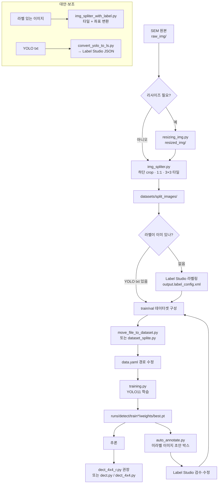

# Label Studio · YOLO 나노갭(nanogap) 검출 워크스페이스

SEM(주사전자현미경) 이미지에서 **작고 많은 단일 클래스 `nanogap`** 을 검출하기 위한 워크스페이스입니다.  
**Ultralytics YOLO11** 로 학습·추론하고, 필요 시 **Label Studio** 사각형 라벨과 연동합니다.

원본 SEM은 해상도가 크고 객체가 작기 때문에, **이미지를 타일로 나눈 뒤(split)** 라벨링·학습·추론하는 흐름을 기본으로 합니다.

> **보안 안내:** 이 GitHub 저장소에는 **SEM 이미지·데이터셋·학습 가중치(`*.pt`)·`runs/` 산출물**을 포함하지 않습니다.  
> 로컬에서 `raw_img/`, `datasets/`, 모델 파일을 준비한 뒤 사용하세요. 제외 규칙은 `.gitignore`를 참고합니다.

---

## 전체 작업 플로우



### 한 줄 요약

1차: **SEM → (리사이즈) → split → Label Studio → train/val → training → 추론**  
이후: **auto_annotate → Label Studio 검수 → 재학습 → 추론** 반복

---

## 요구 사항 / 설치

- Python 3.10 이상 권장 (Label Studio도 Python 3.10+ 권장)
- GPU 학습·추론 시 CUDA 지원 PyTorch

의존성 파일:

| 파일 | 용도 |
|------|------|
| `requirements.txt` | YOLO 학습·추론·전처리 |
| `requirements-labelstudio.txt` | Label Studio (별도 venv 권장) |

### YOLO / 학습 환경

```powershell
python -m venv .venv
.\.venv\Scripts\Activate.ps1
python -m pip install -U pip
pip install -r requirements.txt
```

GPU용 `torch`가 맞지 않으면 [PyTorch 공식 안내](https://pytorch.org/get-started/locally/)로 CUDA 버전을 먼저 설치한 뒤, 나머지를 설치하세요.

```powershell
pip install torch --index-url https://download.pytorch.org/whl/cu124
pip install -r requirements.txt
```

CUDA 사용 가능 여부 확인:

```bash
python check_ver.py
```

Label Studio는 YOLO/학습 환경과 **별도 가상환경**에 설치하는 것을 권장합니다. 아래 [Label Studio 설치 및 실행](#label-studio-설치-및-실행)을 참고하세요.

---

## Label Studio 설치 및 실행

로컬에서 라벨링 UI를 띄우는 방법입니다. 기본 접속 주소는 [http://localhost:8080](http://localhost:8080) 입니다.

### 1) 가상환경 생성·활성화 (Windows)

```powershell
python -m venv .venv-ls
.\.venv-ls\Scripts\Activate.ps1
python -m pip install -U pip
```

Linux / macOS:

```bash
python3 -m venv .venv-ls
source .venv-ls/bin/activate
python -m pip install -U pip
```

### 2) 설치

```bash
pip install -r requirements-labelstudio.txt
```

또는 직접:

```bash
pip install label-studio
```

업그레이드:

```bash
pip install --upgrade label-studio
```

### 3) 실행

```bash
label-studio
```

브라우저가 자동으로 열리지 않으면 [http://localhost:8080](http://localhost:8080) 으로 접속합니다.  
최초 실행 시 계정(이메일·비밀번호)을 만들고 로그인합니다.

포트가 이미 사용 중이면:

```bash
label-studio --port 8081
```

데이터/프로젝트 저장 위치를 지정하려면:

```bash
label-studio start --data-dir C:\label-studio-data
```

### 4) Windows에서 `label-studio` 명령을 못 찾을 때

가상환경이 활성화돼 있는지 확인한 뒤, 아래처럼 실행해 보세요.

```powershell
python -m label_studio
```

또는 Scripts 경로가 PATH에 포함됐는지 확인합니다.

```powershell
where.exe label-studio
```

### 5) (선택) Docker로 실행

Docker가 있으면 pip 대신 컨테이너로 띄울 수 있습니다.

```bash
docker run -it -p 8080:8080 -v %CD%:/label-studio/data heartexlabs/label-studio:latest
```

자세한 옵션은 [Label Studio 설치 문서](https://labelstud.io/guide/install.html)를 참고하세요.

### 6) 이 프로젝트용 초기 설정 (라벨링 시작)

1. Label Studio 웹 UI에서 **Create Project**
2. **Labeling Setup** → Code 모드로 전환 후, 저장소의 `output.label_config.xml` 내용을 붙여넣기

```xml
<View>
  <Image name="image" value="$image"/>
  <Header value="RectangleLabels"/>
  <RectangleLabels name="label" toName="image">
    <Label value="nanogap" background="rgba(218, 1, 238, 1)"/>
  </RectangleLabels>
</View>
```

3. **Import** 에서 `datasets/split_images/` (또는 라벨링 대상 폴더)의 이미지 업로드  
   - 로컬 대량 파일은 *Local Storage* / *Cloud Storage* 연동도 가능 (환경에 따라 추가 설정 필요)
4. 작업자 화면에서 `nanogap` 사각형으로 박스 라벨링 후 **Submit**
5. **Export**  
   - YOLO 학습용: **YOLO** 형식 export (이미지 + `classes.txt` + labels)  
   - 또는 JSON export 후 이 프로젝트 스크립트/수동으로 YOLO 구조에 맞춤

YOLO txt를 Label Studio로 다시 불러 검수할 때:

```bash
# convert_yolo_to_ls.py 하단 변수(경로, 이미지 크기, class_map) 수정 후
python convert_yolo_to_ls.py
```

> Tip: YOLO 학습용 Python 환경과 Label Studio 환경을 분리하면, `ultralytics` / `torch` 와 `label-studio` 의존성 충돌을 줄일 수 있습니다.

---

## 디렉터리 구조

| 경로 | 설명 |
|------|------|
| `raw_img/` | SEM 원본 이미지 |
| `resized_img/` | `resizing_img.py` 결과 (기본 1100×825) |
| `datasets/split_images/` | 타일 분할 결과 (스크립트 기본 출력) |
| `datasets/moved_images/` | split 전 일부 이미지를 빼 둔 폴더 |
| `datasets/dataset/` | YOLO 학습용 `images/{train,val}`, `labels/{train,val}` |
| `runs/detect/` | 학습(`train*`)·예측(`predict*`) 산출물 |
| `output.label_config.xml` | Label Studio `nanogap` RectangleLabels 설정 예시 |
| `data.yaml` | 학습 데이터 경로·클래스 정의 |
| `requirements.txt` | YOLO 학습·추론 의존성 |
| `requirements-labelstudio.txt` | Label Studio 의존성 (별도 venv) |
| `yolo11*.pt`, `yolov8n.pt` | 사전 학습 가중치 (용량 큼) |
| `ui_main.ui` | Qt Designer UI 정의 (실행용 Python은 없을 수 있음) |

> `*.pt`, `runs/` 는 용량이 크므로 Git 커밋·배포 시 주의하세요.

---

## 실행 전 반드시 수정할 설정

대부분 스크립트에 **절대/상대 경로가 하드코딩**되어 있습니다. 현재 PC에 맞게 고친 뒤 실행하세요.

| 파일 | 수정 포인트 |
|------|-------------|
| `data.yaml` | `train` / `val` 경로. 다른 PC의 `D:/Py_Codes/...` 로 남아 있을 수 있음 |
| `training.py` | 가중치(`yolo11m.pt` 등), `epochs`, `imgsz`, `batch`, `device`, `workers` |
| `auto_annotate.py` | `best.pt` 경로, `source` 폴더, `conf` / `iou` / `max_det` |
| `move_file_to_dataset.py` | 원본 이미지·라벨 폴더, `dataset_dir` |
| `dataset_splite.py` | `dataset/images`, `dataset/labels` 실제 위치 |
| `dect.py`, `dect_4x4.py`, `dect_4x4_r.py` | 모델 경로, 입력 이미지 경로 |
| `img_spliter.py` | `input_folder`, `output_dir`, `grid_size` |
| `convert_yolo_to_ls.py` | YOLO txt 경로, 이미지 크기, `class_map` |

`data.yaml` 예시 (이 워크스페이스 기준):

```yaml
train: C:/Pycode/detect_ng_training/datasets/dataset/images/train/
val: C:/Pycode/detect_ng_training/datasets/dataset/images/val/

nc: 1
names: ['nanogap']
max_det: 5000
```

---

## 단계별 사용 가이드

### 1) SEM 원본 배치

원본 이미지를 `raw_img/` 에 넣습니다.

### 2) (선택) 리사이즈

```bash
python resizing_img.py
```

- 입력: `raw_img/`
- 출력: `resized_img/` (기본 `1100×825`)

이후 split 입력을 `resized_img` 로 바꿀지, `raw_img` 를 그대로 쓸지 스크립트 경로에서 결정합니다.

### 3) 이미지 타일 분할 (split)

```bash
python img_spliter.py
```

기본 동작 요약:

- 하단 약 **130px** crop (스케일 바 등 제거 목적)
- **1:1** 비율로 맞춤
- 기본 **3×3** 그리드 분할
- 출력: `datasets/split_images/`
- (스크립트에 따라) 일부 이미지를 `datasets/moved_images/` 로 이동

이미 YOLO 라벨이 있는 이미지를 나눌 때:

```bash
python img_spliter_with_label.py
```

→ 타일뿐 아니라 라벨 좌표도 타일 기준으로 변환합니다.

### 4) Label Studio 라벨링

설치·실행·프로젝트 생성·라벨 설정·Export까지는  
**[Label Studio 설치 및 실행](#label-studio-설치-및-실행)** 을 먼저 따르세요.

요약:

1. `label-studio` 실행 → http://localhost:8080
2. 프로젝트 생성 + `output.label_config.xml` (`nanogap`) 적용
3. `datasets/split_images/` 이미지 Import
4. 박스 라벨링 후 **YOLO** 형식으로 Export
5. export 결과를 `datasets/dataset/` 레이아웃에 맞게 배치 (다음 단계)
### 5) train / val 데이터셋 구성

이미지(`.jpg`)와 라벨(`.txt`)을 YOLO 레이아웃으로 맞춥니다.

```text
datasets/dataset/
  images/train/
  images/val/
  labels/train/
  labels/val/
```

외부 폴더에서 복사·8:2 분할:

```bash
# move_file_to_dataset.py 경로 수정 후
python move_file_to_dataset.py
```

이미 `dataset/images` + `dataset/labels` 가 한곳에 모여 있으면:

```bash
# dataset_splite.py 경로 확인 후
python dataset_splite.py
```

### 6) 학습

1. `data.yaml` 의 `train` / `val` 을 현재 경로로 수정
2. `training.py` 에서 GPU·batch 등 조정
3. 실행:

```bash
python training.py
```

기본 학습 설정(코드 기준):

- 모델: `yolo11m.pt`
- `epochs=500`, `imgsz=704`, `batch=4`, `device=0`, `workers=2`

가중치는 `runs/detect/train*/weights/best.pt` (및 `last.pt`) 에 저장됩니다.

### 7) 추론

| 스크립트 | 용도 |
|----------|------|
| `dect_4x4_r.py` | **실전 권장**. 그리드+padding, IoU 병합, 면적(μm²) 분포 |
| `dect_4x4.py` | 단순 NxN 분할 추론 후 좌표 병합 |
| `dect.py` | 단일 이미지 추론 + 박스 크기별 색상/히스토그램 |

실행 전 각 파일의 `model_path`, 이미지 경로, `conf` / `iou` 등을 수정하세요.

예 (`dect_4x4_r.py` 하단):

```python
detector = ParticleDetector(
    model_path='runs/detect/train22/weights/best.pt',
    grid_size=4,
    iou_threshold=0.08,
    padding=5,
    confidence_threshold=0.5,
    aspect_ratio_threshold=1,
)
detector.visualize_results(r"raw_img/your_sem_image.jpg")
```

### 8) 자동 라벨 → 검수 → 재학습 (반복)

```bash
# auto_annotate.py 에서 best.pt / source / conf 수정 후
python auto_annotate.py
```

- 미라벨 폴더에 대해 예측 이미지 + YOLO `txt` 초안 생성
- Label Studio에서 검수·수정
- train/val 에 반영 후 `training.py` 재실행
- 개선된 `best.pt` 로 다시 추론

---

## 스크립트 레퍼런스

| 파일 | 역할 | 주요 입출력 |
|------|------|-------------|
| `check_ver.py` | CUDA / GPU 사용 가능 여부 출력 | — |
| `resizing_img.py` | 일괄 리사이즈 | `raw_img/` → `resized_img/` |
| `img_spliter.py` | 하단 crop·정사각·그리드 타일 | `raw_img/` → `datasets/split_images/` |
| `img_spliter_with_label.py` | 타일 분할 + 라벨 좌표 변환 | 이미지·txt → 타일·txt |
| `move_file_to_dataset.py` | 외부 데이터 복사·8:2 분할 | 원본 → `datasets/dataset/...` |
| `dataset_splite.py` | 단일 폴더를 train/val 로 이동 | `dataset/images·labels` → `train`/`val` |
| `training.py` | YOLO11 학습 | `data.yaml` → `runs/detect/train*` |
| `auto_annotate.py` | 폴더 일괄 예측·txt 저장 | 이미지 폴더 → predict + labels |
| `convert_yolo_to_ls.py` | YOLO txt → Label Studio JSON | `.txt` → `output.json` |
| `dect.py` | 단일 추론 + 크기 분포 시각화 | 이미지 → `output.jpg` 등 |
| `dect_4x4.py` | 그리드 분할 추론·병합 | 이미지 → 화면/결과 |
| `dect_4x4_r.py` | padding·클러스터링·면적 분석 | 이미지 → 시각화·통계 |
| `output.label_config.xml` | Label Studio 라벨 설정 | Label Studio UI |
| `yolo11.yaml` | 커스텀 구조 스케치(참고용) | 실제 학습은 주로 `yolo11*.pt` + `data.yaml` |
| `requirements.txt` | YOLO/학습 의존성 | `pip install -r requirements.txt` |
| `requirements-labelstudio.txt` | Label Studio 의존성 | `pip install -r requirements-labelstudio.txt` |

---

## 학습 산출물 · 모델 선택 팁

- 학습 결과는 `runs/detect/trainN/` 아래에 쌓입니다.
- 추론·자동라벨에는 보통 `runs/detect/trainN/weights/best.pt` 를 사용합니다.
- 일부 스크립트 예시는 `train21` / `train22` 를 가리키므로, **본인이 학습한 최신 `best.pt` 경로로 바꾸세요.**
- 사전 가중치 크기 대략: `yolo11n` < `yolo11m` < `yolo11l` (속도 ↔ 정확도 트레이드오프)
- 객체가 매우 많을 수 있어 `max_det` 를 크게(예: 5000) 두는 설정이 코드에 포함되어 있습니다.

현재 워크스페이스 참고(환경에 따라 변경됨):

- `datasets/dataset`: train / val 이미지 존재
- `raw_img/`, `resized_img/` 에 샘플 이미지 존재
- `runs/detect/` 에 다수 `train*` / `predict*` 결과 존재

---

## Label Studio 연동 메모

- 설치·실행: [Label Studio 설치 및 실행](#label-studio-설치-및-실행) (`pip install label-studio` → `label-studio` → http://localhost:8080)
- 라벨 설정: `output.label_config.xml` (`nanogap` 사각형)
- 권장 방향: Label Studio에서 라벨 → **YOLO** export → `datasets/dataset` 배치 → 학습
- 반대 방향: YOLO txt → `convert_yolo_to_ls.py` → Label Studio에서 검수
- auto_annotate 초안도 Label Studio 검수를 거친 뒤 학습 데이터에 넣는 것을 권장합니다.
- YOLO용 venv와 Label Studio용 venv를 분리하면 의존성 충돌을 줄일 수 있습니다.

---

## 자주 하는 실수 / 체크리스트

- [ ] Label Studio가 실행 중인가? (`label-studio` → http://localhost:8080)
- [ ] 라벨 설정에 `nanogap` (`output.label_config.xml`)이 반영되었는가?
- [ ] `data.yaml` 의 train/val 경로가 **이 PC**를 가리키는가?
- [ ] 이미지와 라벨 파일명이 쌍으로 맞는가? (`foo.jpg` ↔ `foo.txt`)
- [ ] Label Studio export 형식이 YOLO(정규화 좌표)인가?
- [ ] `training.py` 의 `device` / `batch` 가 GPU 메모리에 맞는가?
- [ ] 추론·`auto_annotate` 의 `best.pt` 가 최신 학습 결과인가?
- [ ] split 한 타일로 학습했다면, 추론도 동일 전처리·그리드 전략을 쓰는가?
- [ ] `conf` / `iou` / `max_det` 가 밀집 객체에 맞게 조정되었는가?

---

## 라이선스

이 저장소에 별도 LICENSE 파일이 없다면, 사용하는 **Ultralytics YOLO** 및 **Label Studio** 각각의 라이선스를 따릅니다.
`)
